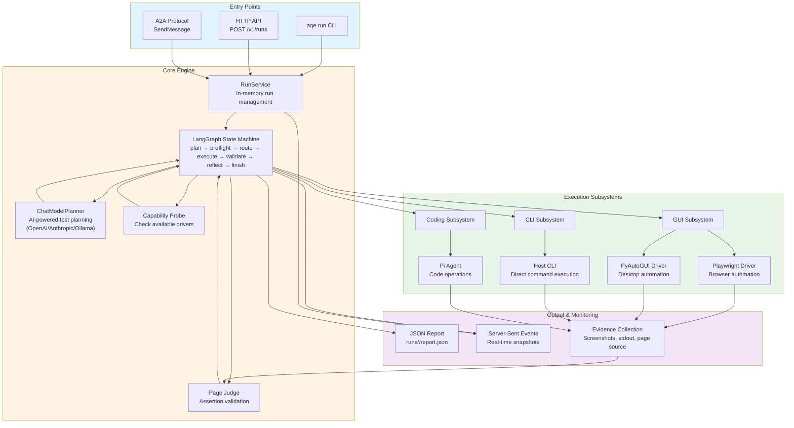
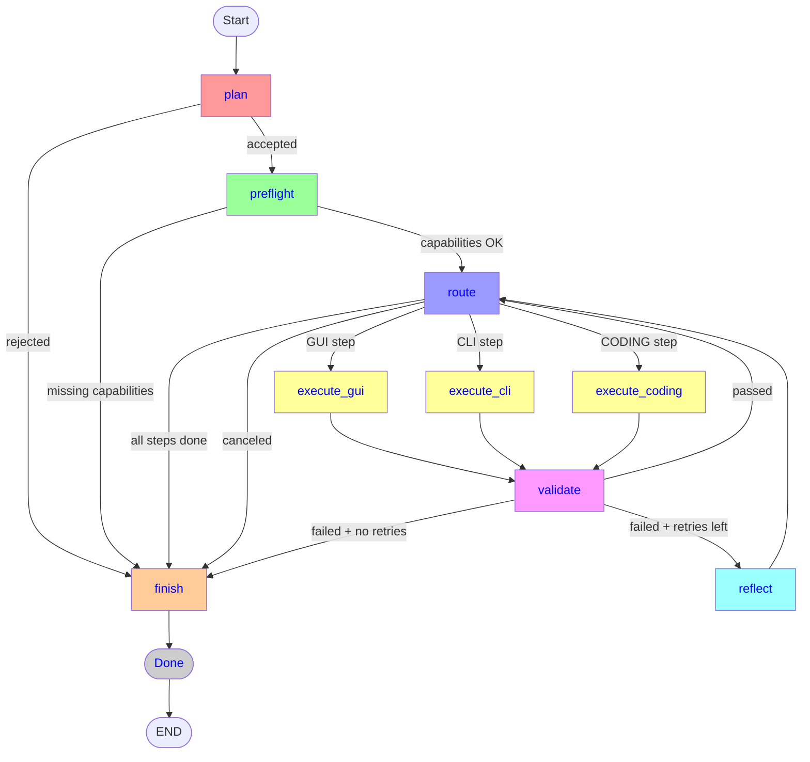

# Agentic Quality Engineering
`aqe` is a quality-engineering service that turns a specification into a test plan, runs each step through a browser, CLI, or coding agent adapter, and returns one JSON report.
A run moves through plan, capability check, execute, validate, and reflect. The same run is available to a person in the browser, to a script over HTTP, and to another agent over [A2A](https://github.com/a2aproject/A2A).

## System Architecture



### Data Flow

1. **Specification Input**: User provides natural language test specification via CLI, HTTP API, or A2A
2. **Planning**: ChatModelPlanner converts specification into structured test steps using LLM
3. **Capability Check**: System verifies required drivers (browser, coding agent) are available
4. **Execution**: Steps are routed to appropriate subsystem:
   - GUI steps → Playwright (browser)
   - CLI steps → Host environment with direct CLI commands or Python scripts
   - CODING steps → Pi agent subprocess for code operations
5. **Validation**: Judge evaluates assertions against collected evidence
6. **Reporting**: JSON report generated with verdict, evidence, and step details
7. **Real-time Monitoring**: Server-sent events provide live progress updates

## LangGraph State Machine

The core execution engine is a LangGraph state machine that orchestrates the testing lifecycle through 9 nodes:



### Node Responsibilities

#### 1. **plan_node** - Test Planning
- **Input**: Natural language specification
- **Process**: Calls ChatModelPlanner to convert specification into structured test steps
- **Validation**: Checks that steps have valid shape (non-empty action, assertion, correct interface/driver)
- **Success**: Transitions to `preflight` with test matrix and step views
- **Failure**: Transitions to `finish` with `not_a_test_plan` reason code

#### 2. **preflight_node** - Capability Check
- **Process**: Probes host for available capabilities (browser, coding agent, LLM)
- **Validation**: Compares required capabilities from test matrix against available ones
- **Success**: Transitions to `route` if all required capabilities are available
- **Failure**: Transitions to `finish` with `missing_capability` reason code

#### 3. **route_node** - Step Routing
- **Process**: Determines next step to execute or checks completion
- **Cancel Check**: If cancel requested, transitions to `finish` with `canceled` reason code
- **Completion Check**: If all steps executed, transitions to `finish` with success
- **Routing**: Sets current step to `running` and routes to `execute_gui`, `execute_cli`, or `execute_coding` based on interface

#### 4. **execute_gui_node** - GUI Execution
- **Process**: Executes GUI step through GUISubsystem (Playwright or PyAutoGUI)
- **Evidence Collection**: Captures screenshots, page source, and page text
- **Success**: Transitions to `validate` with ActionResult
- **Error**: Transitions to `finish` with appropriate error code (browser_launch_failed, engine_error, etc.)

#### 5. **execute_cli_node** - CLI Execution
- **Process**: Executes CLI step through CLISubsystem in host environment
- **Command Execution**: Uses direct CLI commands or Python scripts based on complexity
- **Tool Installation**: Automatically installs missing tools (curl, wget, jq, etc.) if needed
- **Evidence Collection**: Captures stdout, stderr, and execution summary
- **Success**: Transitions to `validate` with ActionResult
- **Error**: Transitions to `finish` with `engine_error` or other error codes

#### 6. **execute_coding_node** - Coding Agent Execution
- **Process**: Executes CODING step through CodingSubsystem with Pi agent subprocess
- **Pi Agent Management**: Starts Pi agent in RPC mode for code operations
- **Code Operations**: Supports create_file, update_file, review_code, execute_code
- **Evidence Collection**: Captures file operations, execution results, and error details
- **Success**: Transitions to `validate` with ActionResult
- **Error**: Transitions to `finish` with `coding_agent_failed` or `coding_agent_not_available`

#### 7. **validate_node** - Assertion Validation
- **Process**: Evaluates step assertions against collected evidence
- **Validation Methods**:
  - Structured checks (`contains:`, `json:`, `status:`) → direct evaluation
  - CLI output → PageJudge evaluation
  - Page source → PageJudge evaluation
  - Generic output → PageJudge evaluation
- **Success**: Transitions to `route` with incremented step index
- **Retry**: If failed and retries remaining, transitions to `reflect` with retry status
- **Failure**: If failed and no retries left, transitions to `finish` with `assertion_failed` reason code

#### 8. **reflect_node** - Retry Reflection
- **Process**: Placeholder for future retry logic improvements
- **Current Behavior**: Simply transitions back to `route` for retry attempt
- **Purpose**: Allows for intelligent retry strategies (e.g., adjusting parameters, waiting)

#### 9. **finish_node** - Report Generation
- **Process**: Determines final verdict based on execution results
- **Verdict Logic**:
  - `canceled` → if cancel was requested
  - `rejected` → if missing capability or not a test plan
  - `error` → if driver errors occurred
  - `pass` → if all steps passed
  - `fail` → if any step failed
  - `rejected` → if no steps and no specific reason
- **Output**: Generates TestReport with verdict, reason code, and step details
- **Transition**: Transitions to `done` phase

### State Management

The `AgentState` tracks execution progress:

```python
{
    "run_id": str,              # Unique run identifier
    "specification": str,       # Original test specification
    "current_step": int,        # Current step index
    "test_matrix": list,        # Planned test steps
    "execution_history": list,  # Step execution results
    "attempt_counts": dict,     # Retry attempts per step
    "phase": str,               # Current graph phase
    "step_views": list,         # Step status for UI
    "last_result": dict,        # Most recent ActionResult
    "report": dict,             # Final TestReport
    "reason_code": str,         # Failure reason code
    "reason": str,              # Human-readable reason
    "missing": list,            # Missing capabilities
}
```

### Error Handling

The state machine handles errors at multiple levels:

- **Planning Errors**: Invalid planner output → `not_a_test_plan`
- **Capability Errors**: Missing drivers → `missing_capability`
- **Execution Errors**: Driver failures → specific error codes
  - GUI: `browser_launch_failed`
  - CLI: `engine_error`
  - CODING: `coding_agent_failed`, `coding_agent_not_available`
- **Validation Errors**: Assertion failures → `assertion_failed` (with retry)
- **System Errors**: Unexpected exceptions → `engine_error`

### Retry Logic

Failed steps can be retried based on `max_retries` configuration:
- Validation failure increments attempt counter
- If attempts ≤ max_retries → transition to `reflect` then `route`
- If attempts > max_retries → transition to `finish` with failure
- Subsequent steps are skipped on final failure

### Supported Interfaces

| Interface | Driver | Use Case |
|-----------|--------|----------|
| GUI Browser | Playwright | Web application testing |
| GUI Desktop | PyAutoGUI | Desktop application testing |
| CLI | Host Environment | Command-line tool testing with automatic tool installation |
| CODING | Pi Agent | Code operations (file creation, updates, review, execution) |

### Coding Agent Operations

The CODING interface supports the following operations through the Pi agent:

- **create_file**: Create a new file with specified content
- **update_file**: Modify an existing file with new content
- **review_code**: Analyze and review code files
- **execute_code**: Run Python scripts and capture output

#### Non-Testing Steps and Operations-Only Plans

Steps can be defined without explicit assertions for setup or preparation operations. Additionally, entire test plans can consist of operations without any assertions:

- **Setup Steps**: Operations like "Create a directory" or "Install dependencies" that don't need verification
- **Operations-Only Plans**: Test plans with no assertions at all - the test passes if all operations succeed
- **Failure Impact**: If any operation fails (setup or otherwise), the entire test fails
- **Validation**: Success is determined by whether the operation completed successfully (ActionResult.ok)

#### Example Specification (Operations Only)

```markdown
1. CODING: Create a project directory structure

2. CODING: Create a Python test file with a hello world function

3. CODING: Update the test file to add a main function

4. CODING: Create a requirements.txt file with dependencies
```

In this example:
- All steps are operations without assertions
- The test passes if all file operations succeed
- If any operation fails, the test fails immediately

#### Example Specification (Mixed Setup and Testing)

```markdown
1. CODING: Create a project directory structure
   # No assertion - setup step that must succeed

2. CODING: Create a Python test file with a hello world function
   Assertion: File created successfully

3. CLI: Run the test file
   Assertion: Output contains 'hello world'
```

In this example:
- Step 1 is a setup step - if directory creation fails, the test fails
- Steps 2-3 are testing steps with explicit assertions
- All steps must succeed for the overall test to pass

#### Pi Agent Requirements

- Pi agent must be installed and available in the system PATH
- The system checks for Pi availability during capability check
- If Pi is not available, CODING steps will be rejected with `coding_agent_not_available` reason code
- Pi agent is started in RPC mode for each coding operation
- Subprocess errors are handled with `coding_agent_failed` reason code

#### Pi Agent LLM Configuration

- The LLM model used by Pi agent is determined via the `PI_LLM_MODEL` environment variable
- If `PI_LLM_MODEL` is set, the system checks if Pi has access to that specific model
- If Pi does not have access to the specified model, the coding capability is disabled
- The UI reflects this issue with appropriate error messages
- If `PI_LLM_MODEL` is not set, Pi uses its default model configuration

**Example .env configuration:**
```bash
# Pi coding agent LLM model (optional)
PI_LLM_MODEL=gpt-4o
```

## Install
Python 3.11 or newer.
```bash
uv venv
uv pip install -e .
uv run playwright install chromium
uv run playwright install-deps
```
That install includes Playwright, the OpenAI, Anthropic, and Ollama clients, and pytest. Chromium is downloaded by the commands above. For coding operations, install the Pi agent separately. Copy `.env_template` to `.env` and set `LLM_PROVIDER` to `openai`, `anthropic`, or `ollama`, plus `LLM_MODEL` and the matching credentials. OpenAI can use `OPENAI_API_KEY`, an AIA gateway (`AIA_GATEWAY_CLIENT_ID`, `AIA_GATEWAY_CLIENT_SECRET`, `AIA_GATEWAY_BASE_URL`), or `REALLM_BASE_URL` with `REALLM_API_KEY`. Set `SSL_VERIFY=false` only when the gateway certificate cannot be verified. Optionally set `PI_LLM_MODEL` to specify which LLM model the Pi agent should use for coding operations.
Headless Playwright does not need a display.
## Run a specification
`aqe run` and `aqe serve` take no flags. Set the command parameters in `.env`.

```bash
uv run aqe run
```

`SPEC_PATH` is the specification file. `aqe run` starts the sample registration app on `SUT_PORT`, plans with the chat model in `.env`, drives browser steps with headless Chromium, checks CLI steps in the host environment, and executes coding steps through the Pi agent. The command prints the path to `runs/<id>/report.json`. Exit status is `0` when `verdict` is `pass`.

If Chromium or the Pi agent is missing, the run is rejected before any step executes.

## Serve the agent
```bash
uv run aqe serve
```
The process binds `HOST` and `PORT` from `.env` (`127.0.0.1:8000` by default) with no authentication. Reports are written under `RUNS_DIR`.
- `http://127.0.0.1:8000/` submits a specification and lists runs. Chips show whether the browser and coding agent are available on this host.
- `http://127.0.0.1:8000/runs/<id>` shows each step as it moves from pending to running to passed, failed, retrying, error, or skipped.
- `GET /healthz` stays healthy even when optional drivers are absent.
- `GET /v1/capabilities` reports `browser` and `coding`.
### HTTP
```bash
curl -s -X POST http://127.0.0.1:8000/v1/runs \
  -H 'content-type: application/json' \
  -d '{"specification":"# check\n\nCLI: Read the webhook\nAssertion: json:user=ada\n"}'
```
A blank or oversized specification returns `400` and does not create a run. A valid body returns `202` with an id. Poll `GET /v1/runs/<id>` until `ready` is true, then read `report`. `ready` is true for `completed`, `failed`, `rejected`, and `canceled`. While the run is `submitted` or `working`, `report` is null.
`GET /v1/runs/<id>/events` is a server-sent stream of the same snapshots. The stream ends on the first snapshot where `ready` is true.
### A2A
Discover the agent at `GET /.well-known/agent-card.json`. Send the specification as the text of a `SendMessage` call. The task id is the run id. `SendMessage` returns while the task is `submitted` or `working`. Poll `GetTask` until `status.state` is `TASK_STATE_COMPLETED`, `TASK_STATE_FAILED`, `TASK_STATE_REJECTED`, or `TASK_STATE_CANCELED`, then read the JSON artifact. Send `A2A-Version: 1.0`. A message with no text or file part is invalid and does not create a task.
## Report
Every finished run writes the same `TestReport` object to `runs/<id>/report.json`, to `report` on the HTTP snapshot, and to the A2A artifact.
`verdict` is the result to branch on:
| Verdict | Meaning |
| --- | --- |
| `pass` | Every step assertion passed. |
| `fail` | A step ran and its assertion did not hold. |
| `error` | The harness broke after start. The result is inconclusive. |
| `rejected` | The text could not become a plan, or the host is missing a driver the plan needs. |
| `canceled` | The run was canceled before it finished. |
A pass has `verdict == "pass"`. `specification` is the testing request that was submitted. `reason_code` explains a non-pass (`assertion_failed`, `browser_launch_failed`, `driver_timeout`, `engine_error`, `not_a_test_plan`, `missing_capability`, `coding_agent_failed`, `coding_agent_not_available`, or `canceled`). Each step has `assertion_passed` set to `true`, `false`, or `null`.
## Tests
```bash
uv run pytest
uv run pytest -m integration
```
`uv run pytest` injects test drivers so it does not launch Chromium. The integration test runs Playwright and the configured chat model, and skips when the browser is not installed.
## Layout
- `src/aqe/graph.py` is the plan, route, execute, validate, and reflect loop.
- `src/aqe/gui/` captures, grounds, and acts through Playwright or PyAutoGUI.
- `src/aqe/cli_runtime/` executes CLI commands in the host environment.
- `src/aqe/coding_agent/` manages Pi agent subprocess for code operations.
- `src/aqe/api.py` serves the HTTP API, the event stream, the UI, and A2A.
- `examples/specs/registration.md` is the sample plan. `examples/sut/server.py` is the registration form `aqe run` starts.
- `examples/specs/coding_example.md` demonstrates coding agent usage.