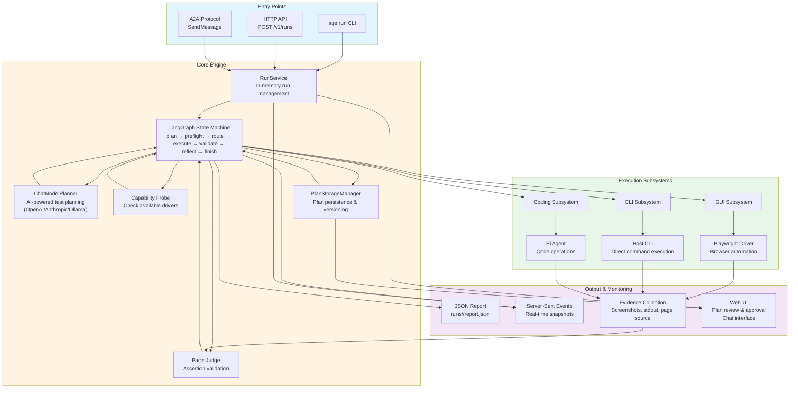
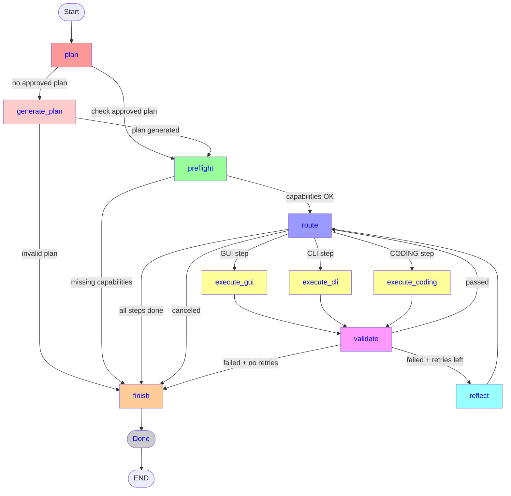

# Agentic Quality Engineering
`aqe` is a quality-engineering service that turns a specification into a test plan, runs each step through a browser, CLI, or coding agent adapter, and returns one JSON report.
A run moves through plan, capability check, execute, validate, and reflect. The same run is available to a person in the browser, to a script over HTTP, and to another agent over [A2A](https://github.com/a2aproject/A2A).

## Human-in-the-Loop Planner

The system features a human-in-the-loop planner that allows users to review, refine, and approve test plans before execution:

- **Draft Plans**: Plans are initially generated in "draft" status
- **Plan Review**: Users can review the plan through the web UI or API
- **Interactive Refinement**: A chat interface allows users to request changes to the plan
- **Plan Approval**: Execution only begins after the user approves the plan
- **Plan History**: All plan versions are stored with version tracking
- **Re-run Capability**: Users can re-trigger execution for completed/failed runs using the approved plan

## System Architecture


```mermaid
graph TB
    subgraph Entry_Points["Entry Points"]
        CLI["aqe run CLI"]
        HTTP["HTTP API<br/>POST /v1/runs"]
        A2A["A2A Protocol<br/>SendMessage"]
    end

    subgraph Core_Engine["Core Engine"]
        RunService["RunService<br/>In-memory run management"]
        LangGraph["LangGraph State Machine<br/>plan → preflight → route → execute → validate → reflect → finish"]
        Planner["ChatModelPlanner<br/>AI-powered test planning<br/>(OpenAI/Anthropic/Ollama)"]
        Capability["Capability Probe<br/>Check available drivers"]
        Judge["Page Judge<br/>Assertion validation"]
        PlanStorage["PlanStorageManager<br/>Plan persistence & versioning"]
    end

    subgraph Execution["Execution Subsystems"]
        GUISub["GUI Subsystem"]
        CLISub["CLI Subsystem"]
        CodingSub["Coding Subsystem"]
        Playwright["Playwright Driver<br/>Browser automation"]
        HostCLI["Host CLI<br/>Direct command execution"]
        PiAgent["Pi Agent<br/>Code operations"]
    end

    subgraph Output["Output & Monitoring"]
        Report["JSON Report<br/>runs/<id>/report.json"]
        SSE["Server-Sent Events<br/>Real-time snapshots"]
        Evidence["Evidence Collection<br/>Screenshots, stdout, page source"]
        UI["Web UI<br/>Plan review & approval<br/>Chat interface"]
    end

    CLI --> RunService
    HTTP --> RunService
    A2A --> RunService

    RunService --> LangGraph
    LangGraph --> Planner
    LangGraph --> Capability
    LangGraph --> Judge
    LangGraph --> PlanStorage

    Planner --> LangGraph
    Capability --> LangGraph
    PlanStorage --> LangGraph

    LangGraph --> GUISub
    LangGraph --> CLISub
    LangGraph --> CodingSub

    GUISub --> Playwright
    CLISub --> HostCLI
    CodingSub --> PiAgent

    Playwright --> Evidence
    HostCLI --> Evidence
    PiAgent --> Evidence

    Evidence --> Judge
    Judge --> LangGraph

    LangGraph --> Report
    LangGraph --> SSE
    RunService --> SSE
    RunService --> UI
    PlanStorage --> UI

    style Entry_Points fill:#e1f5ff
    style Core_Engine fill:#fff4e1
    style Execution fill:#e8f5e9
    style Output fill:#f3e5f5
```

### Data Flow

1. **Specification Input**: User provides natural language test specification via CLI, HTTP API, or A2A
2. **Planning**: ChatModelPlanner converts specification into structured test steps using LLM
3. **Plan Storage**: Draft plan is saved to file system with version tracking
4. **Plan Review**: User reviews the plan through web UI or API endpoints
5. **Interactive Refinement**: User can request changes via chat interface to refine the plan
6. **Plan Approval**: User approves the plan (status changes from "draft" to "approved")
7. **Capability Check**: System verifies required drivers (browser, coding agent) are available
8. **Execution**: Steps are routed to appropriate subsystem:
   - GUI steps → Playwright (browser)
   - CLI steps → Host environment with direct CLI commands or Python scripts
   - CODING steps → Pi agent subprocess for code operations
9. **Validation**: Judge evaluates assertions against collected evidence
10. **Reporting**: JSON report generated with verdict, evidence, and step details
11. **Real-time Monitoring**: Server-sent events provide live progress updates
12. **Re-run Capability**: Users can re-trigger execution for completed/failed runs using the approved plan

## LangGraph State Machine

The core execution engine is a LangGraph state machine that orchestrates the testing lifecycle through 10 nodes:


```mermaid
graph TD
    Start([Start]) --> plan
    plan -->|check approved plan| preflight
    plan -->|no approved plan| generate_plan
    generate_plan -->|plan generated| preflight
    generate_plan -->|invalid plan| finish
    preflight -->|capabilities OK| route
    preflight -->|missing capabilities| finish
    route -->|GUI step| execute_gui
    route -->|CLI step| execute_cli
    route -->|CODING step| execute_coding
    route -->|all steps done| finish
    route -->|canceled| finish
    execute_gui --> validate
    execute_cli --> validate
    execute_coding --> validate
    validate -->|passed| route
    validate -->|failed + retries left| reflect
    validate -->|failed + no retries| finish
    reflect --> route
    finish --> done([Done])
    done --> END([END])

    style plan fill:#ff9999,color:#0000ff
    style generate_plan fill:#ffcccc,color:#0000ff
    style preflight fill:#99ff99,color:#0000ff
    style route fill:#9999ff,color:#0000ff
    style execute_gui fill:#ffff99,color:#0000ff
    style execute_cli fill:#ffff99,color:#0000ff
    style execute_coding fill:#ffff99,color:#0000ff
    style validate fill:#ff99ff,color:#0000ff
    style reflect fill:#99ffff,color:#0000ff
    style finish fill:#ffcc99,color:#0000ff
    style done fill:#cccccc,color:#0000ff
```

### Node Responsibilities

#### 1. **plan_node** - Plan Approval Check
- **Input**: Run state with run_id
- **Process**: Checks if an approved plan exists for the run
- **Success**: If approved plan exists, transitions to `preflight` with the approved plan
- **Plan Generation**: If no approved plan exists, transitions to `generate_plan` to create a new plan
- **Failure**: If plan generation fails, transitions to `finish` with `not_a_test_plan` reason code

#### 2. **generate_plan_node** - Test Plan Generation
- **Input**: Natural language specification
- **Process**: Calls ChatModelPlanner to convert specification into structured test steps
- **Validation**: Checks that steps have valid shape (non-empty action, assertion, correct interface/driver)
- **Plan Storage**: Saves the generated plan to file system with version tracking
- **Success**: Transitions to `preflight` with test matrix and step views
- **Failure**: Transitions to `finish` with `not_a_test_plan` reason code

#### 3. **preflight_node** - Capability Check
- **Process**: Probes host for available capabilities (browser, coding agent, LLM)
- **Validation**: Compares required capabilities from test matrix against available ones
- **Success**: Transitions to `route` if all required capabilities are available
- **Failure**: Transitions to `finish` with `missing_capability` reason code

#### 4. **route_node** - Step Routing
- **Process**: Determines next step to execute or checks completion
- **Cancel Check**: If cancel requested, transitions to `finish` with `canceled` reason code
- **Completion Check**: If all steps executed, transitions to `finish` with success
- **Routing**: Sets current step to `running` and routes to `execute_gui`, `execute_cli`, or `execute_coding` based on interface

#### 5. **execute_gui_node** - GUI Execution
- **Process**: Executes GUI step through GUISubsystem (Playwright)
- **Evidence Collection**: Captures screenshots, page source, and page text
- **Success**: Transitions to `validate` with ActionResult
- **Error**: Transitions to `finish` with appropriate error code (browser_launch_failed, engine_error, etc.)

#### 6. **execute_cli_node** - CLI Execution
- **Process**: Executes CLI step through CLISubsystem in host environment
- **Command Execution**: Uses direct CLI commands or Python scripts based on complexity
- **Tool Installation**: Automatically installs missing tools (curl, wget, jq, etc.) if needed
- **Evidence Collection**: Captures stdout, stderr, and execution summary
- **Success**: Transitions to `validate` with ActionResult
- **Error**: Transitions to `finish` with `engine_error` or other error codes

#### 7. **execute_coding_node** - Coding Agent Execution
- **Process**: Executes CODING step through CodingSubsystem with Pi agent subprocess
- **Pi Agent Management**: Starts Pi agent in RPC mode for code operations
- **Code Operations**: Supports create_file, update_file, review_code, execute_code
- **Evidence Collection**: Captures file operations, execution results, and error details
- **Success**: Transitions to `validate` with ActionResult
- **Error**: Transitions to `finish` with `coding_agent_failed` or `coding_agent_not_available`

#### 8. **validate_node** - Assertion Validation
- **Process**: Evaluates step assertions against collected evidence
- **Validation Methods**:
  - Structured checks (`contains:`, `json:`, `status:`) → direct evaluation
  - CLI output → PageJudge evaluation
  - Page source → PageJudge evaluation
  - Generic output → PageJudge evaluation
- **Success**: Transitions to `route` with incremented step index
- **Retry**: If failed and retries remaining, transitions to `reflect` with retry status
- **Failure**: If failed and no retries left, transitions to `finish` with `assertion_failed` reason code

#### 9. **reflect_node** - Retry Reflection
- **Process**: Placeholder for future retry logic improvements
- **Current Behavior**: Simply transitions back to `route` for retry attempt
- **Purpose**: Allows for intelligent retry strategies (e.g., adjusting parameters, waiting)

#### 10. **finish_node** - Report Generation
- **Process**: Determines final verdict based on execution results
- **Verdict Logic**:
  - `canceled` → if cancel was requested
  - `rejected` → if missing capability or not a test plan
  - `error` → if driver errors occurred
  - `pass` → if all steps passed
  - `fail` → if any step failed
  - `rejected` → if no steps and no specific reason
- **Output**: Generates TestReport with verdict, reason code, and step details
- **Transition**: Transitions to `done` phase

### State Management

The `AgentState` tracks execution progress:

```python
{
    "run_id": str,              # Unique run identifier
    "specification": str,       # Original test specification
    "current_step": int,        # Current step index
    "test_matrix": list,        # Planned test steps
    "execution_history": list,  # Step execution results
    "attempt_counts": dict,     # Retry attempts per step
    "phase": str,               # Current graph phase
    "step_views": list,         # Step status for UI
    "last_result": dict,        # Most recent ActionResult
    "report": dict,             # Final TestReport
    "reason_code": str,         # Failure reason code
    "reason": str,              # Human-readable reason
    "missing": list,            # Missing capabilities
}
```

### Human-in-the-Loop Planner

The system includes a human-in-the-loop planner that allows users to review and approve test plans before execution.

#### Plan Status Flow

1. **draft**: Initial plan generated by the planner
2. **approved**: Plan approved by user, ready for execution
3. **rejected**: Plan rejected by user

#### Plan Storage

Plans are stored in the file system under `runs/<run_id>/plan.json` with version tracking:
- Each plan version is stored in `runs/<run_id>/plans/v<version>.json`
- Current approved plan is linked from `runs/<run_id>/plan.json`
- Plan history includes metadata (timestamp, version, status)

#### API Endpoints

**Plan Management:**
- `GET /v1/runs/{run_id}/plan` - Get current plan
- `POST /v1/runs/{run_id}/plan/approve` - Approve plan and start execution
- `POST /v1/runs/{run_id}/plan/reject` - Reject plan
- `GET /v1/runs/{run_id}/plan/download` - Download plan as markdown file

**Planner Chat:**
- `POST /v1/runs/{run_id}/planner/chat` - Send message to planner for plan refinement
- `GET /v1/runs/{run_id}/planner/chat/history` - Get chat history

**Execution Control:**
- `POST /v1/runs/{run_id}:start` - Start execution (for re-running completed/failed runs)

#### Web UI Features

The web UI provides:
- **Plan Display**: Shows the current plan in markdown format
- **Chat Panel**: Interactive chat interface for plan refinement
- **Approval Controls**: Approve/Reject/Request Changes buttons
- **Plan Download**: Download plan as markdown file
- **Re-run Button**: Re-trigger execution for completed/failed runs
- **Real-time Updates**: Step status updates via SSE

#### Plan Refinement Workflow

1. User submits specification
2. Planner generates initial plan (status: draft)
3. User reviews plan in web UI
4. User can:
   - Approve plan → execution starts
   - Reject plan → run marked as rejected
   - Request changes via chat → planner refines plan
5. After refinement, user can approve the updated plan
6. Execution begins with approved plan

#### Re-run Capability

For runs in terminal states (completed, failed, canceled):
- User can click "Re-run Plan" button
- System re-uses the approved plan
- Run record is reset
- Execution starts with the same plan
- Useful for debugging or retrying after fixing issues

### Error Handling

The state machine handles errors at multiple levels:

- **Planning Errors**: Invalid planner output → `not_a_test_plan`
- **Capability Errors**: Missing drivers → `missing_capability`
- **Execution Errors**: Driver failures → specific error codes
  - GUI: `browser_launch_failed`
  - CLI: `engine_error`
  - CODING: `coding_agent_failed`, `coding_agent_not_available`
- **Validation Errors**: Assertion failures → `assertion_failed` (with retry)
- **System Errors**: Unexpected exceptions → `engine_error`
- **Plan Validation Errors**: Invalid step structure → marks step as ERROR, subsequent steps as SKIPPED, transitions to `finish` with `engine_error`

#### Error Handling Improvements

The system now includes comprehensive error handling to prevent steps from getting stuck in retrying states:

1. **Validation Error Handling**: Catches validation errors during step execution and marks the step as ERROR instead of RETRYING
2. **Step Status Management**: When an error occurs:
   - Current step is marked as ERROR
   - All subsequent steps are marked as SKIPPED
   - Execution routes to finish with `engine_error` reason code
3. **Auto-correction**: Common LLM mistakes in action names are automatically corrected:
   - `execute_command` → `execute_code`
   - `execute_shell` → `execute_code`
   - `run_command` → `execute_code`
   - `run` → `execute_code` (for coding operations)

### Retry Logic

Failed steps can be retried based on `max_retries` configuration:
- Validation failure increments attempt counter
- If attempts ≤ max_retries → transition to `reflect` then `route`
- If attempts > max_retries → transition to `finish` with failure
- Subsequent steps are skipped on final failure

### Supported Interfaces

| Interface | Driver | Use Case |
|-----------|--------|----------|
| GUI Browser | Playwright | Web application testing |
| CLI | Host Environment | Command-line tool testing with automatic tool installation |
| CODING | Pi Agent | Code operations (file creation, updates, review, execution) |

### Coding Agent Operations

The CODING interface supports the following operations through the Pi agent:

- **create_file**: Create a new file with specified content
- **update_file**: Modify an existing file with new content
- **review_code**: Analyze and review code files
- **execute_code**: Run Python scripts and capture output

#### Non-Testing Steps and Operations-Only Plans

Steps can be defined without explicit assertions for setup or preparation operations. Additionally, entire test plans can consist of operations without any assertions:

- **Setup Steps**: Operations like "Create a directory" or "Install dependencies" that don't need verification
- **Operations-Only Plans**: Test plans with no assertions at all - the test passes if all operations succeed
- **Failure Impact**: If any operation fails (setup or otherwise), the entire test fails
- **Validation**: Success is determined by whether the operation completed successfully (ActionResult.ok)

#### Example Specification (Operations Only)

```markdown
1. CODING: Create a project directory structure

2. CODING: Create a Python test file with a hello world function

3. CODING: Update the test file to add a main function

4. CODING: Create a requirements.txt file with dependencies
```

In this example:
- All steps are operations without assertions
- The test passes if all file operations succeed
- If any operation fails, the test fails immediately

#### Example Specification (Mixed Setup and Testing)

```markdown
1. CODING: Create a project directory structure
   # No assertion - setup step that must succeed

2. CODING: Create a Python test file with a hello world function
   Assertion: File created successfully

3. CLI: Run the test file
   Assertion: Output contains 'hello world'
```

In this example:
- Step 1 is a setup step - if directory creation fails, the test fails
- Steps 2-3 are testing steps with explicit assertions
- All steps must succeed for the overall test to pass

#### Pi Agent Requirements

- Pi agent must be installed and available in the system PATH
- The system checks for Pi availability during capability check
- If Pi is not available, CODING steps will be rejected with `coding_agent_not_available` reason code
- Pi agent is started in RPC mode for each coding operation
- Subprocess errors are handled with `coding_agent_failed` reason code

#### Pi Agent LLM Configuration

- The LLM model used by Pi agent is determined via the `PI_LLM_MODEL` environment variable
- If `PI_LLM_MODEL` is set, the system checks if Pi has access to that specific model
- If Pi does not have access to the specified model, the coding capability is disabled
- The UI reflects this issue with appropriate error messages
- If `PI_LLM_MODEL` is not set, Pi uses its default model configuration

**Example .env configuration:**
```bash
# Pi coding agent LLM model (optional)
PI_LLM_MODEL=gpt-4o
```

## Install
Python 3.11 or newer.
```bash
uv venv
uv pip install -e .
uv run playwright install chromium
uv run playwright install-deps
```
That install includes Playwright, the OpenAI, Anthropic, and Ollama clients, and pytest. Chromium is downloaded by the commands above. For coding operations, install the Pi agent separately. Copy `.env_template` to `.env` and set `LLM_PROVIDER` to `openai`, `anthropic`, or `ollama`, plus `LLM_MODEL` and the matching credentials. OpenAI can use `OPENAI_API_KEY`, an AIA gateway (`AIA_GATEWAY_CLIENT_ID`, `AIA_GATEWAY_CLIENT_SECRET`, `AIA_GATEWAY_BASE_URL`), or `REALLM_BASE_URL` with `REALLM_API_KEY`. Set `SSL_VERIFY=false` only when the gateway certificate cannot be verified. Optionally set `PI_LLM_MODEL` to specify which LLM model the Pi agent should use for coding operations.

### System Chrome Configuration

If you encounter firewall or proxy issues when downloading Playwright's bundled Chrome, you can use system Chrome instead:

**Environment Variables:**
- `USE_SYSTEM_CHROME`: Use system Chrome instead of downloading (set to `true`)
- `CHROME_EXECUTABLE_PATH`: Path to Chrome executable (auto-detected if not set)

**Examples:**
```bash
# Use system Chrome
USE_SYSTEM_CHROME=true make install-browser
USE_SYSTEM_CHROME=true make serve-container

# With explicit Chrome path
USE_SYSTEM_CHROME=true CHROME_EXECUTABLE_PATH=/usr/bin/google-chrome make serve-container
```

**For Docker Containers:**
When using `make serve-container USE_SYSTEM_CHROME=true`, the system will automatically install Google Chrome in the container before starting the service.

**System Chrome Prerequisites:**
When using `USE_SYSTEM Chrome=true`, ensure Chrome is installed:
- Linux: `sudo apt-get install google-chrome-stable` or download from google.com/chrome
- macOS: Download from google.com/chrome or `brew install --cask google-chrome`
- Windows: Download from google.com/chrome

The system will auto-detect Chrome in common locations, or you can specify the path with `CHROME_EXECUTABLE_PATH`.
Headless Playwright does not need a display.
## Run a specification
`aqe run` and `aqe serve` take no flags. Set the command parameters in `.env`.

```bash
uv run aqe run
```

`SPEC_PATH` is the specification file. `aqe run` starts the sample registration app on `SUT_PORT`, plans with the chat model in `.env`, drives browser steps with headless Chromium, checks CLI steps in the host environment, and executes coding steps through the Pi agent. The command prints the path to `runs/<id>/report.json`. Exit status is `0` when `verdict` is `pass`.

If Chromium or the Pi agent is missing, the run is rejected before any step executes.

## Serve the agent
```bash
uv run aqe serve
```
The process binds `HOST` and `PORT` from `.env` (`127.0.0.1:8000` by default) with no authentication. Reports are written under `RUNS_DIR`.
- `http://127.0.0.1:8000/` submits a specification and lists runs. Chips show whether the browser and coding agent are available on this host.
- `http://127.0.0.1:8000/runs/<id>` shows each step as it moves from pending to running to passed, failed, retrying, error, or skipped.
- `GET /healthz` stays healthy even when optional drivers are absent.
- `GET /v1/capabilities` reports `browser` and `coding`.
### HTTP
```bash
curl -s -X POST http://127.0.0.1:8000/v1/runs \
  -H 'content-type: application/json' \
  -d '{"specification":"# check\n\nCLI: Read the webhook\nAssertion: json:user=ada\n"}'
```
A blank or oversized specification returns `400` and does not create a run. A valid body returns `202` with an id. The run starts in `submitted` status with a draft plan.

**Plan Management:**
- `GET /v1/runs/{run_id}/plan` - Get current plan (returns plan with status: draft/approved/rejected)
- `POST /v1/runs/{run_id}/plan/approve` - Approve plan and start execution (changes status to approved, triggers execution)
- `POST /v1/runs/{run_id}/plan/reject` - Reject plan (changes status to rejected, run marked as rejected)
- `GET /v1/runs/{run_id}/plan/download` - Download plan as markdown file

**Planner Chat:**
- `POST /v1/runs/{run_id}/planner/chat` - Send message to planner for plan refinement (returns updated plan)
- `GET /v1/runs/{run_id}/planner/chat/history` - Get chat history (returns array of messages)

**Execution Control:**
- `POST /v1/runs/{run_id}:start` - Start execution (for re-running completed/failed runs with approved plan)

**Monitoring:**
- `GET /v1/runs/{run_id}` - Get run status (includes plan status, execution status, step views)
- `GET /v1/runs/{run_id}/events` - Server-sent stream of snapshots (stream ends when run is ready)

Poll `GET /v1/runs/<id>` until `ready` is true, then read `report`. `ready` is true for `completed`, `failed`, `rejected`, and `canceled`. While the run is `submitted` or `working`, `report` is null. Note that execution only starts after plan approval.
### A2A
Discover the agent at `GET /.well-known/agent-card.json`. Send the specification as the text of a `SendMessage` call. The task id is the run id. `SendMessage` returns while the task is `submitted` or `working`. The run starts with a draft plan that must be approved before execution. Poll `GetTask` until `status.state` is `TASK_STATE_COMPLETED`, `TASK_STATE_FAILED`, `TASK_STATE_REJECTED`, or `TASK_STATE_CANCELED`, then read the JSON artifact. Send `A2A-Version: 1.0`. A message with no text or file part is invalid and does not create a task.
## Report
Every finished run writes the same `TestReport` object to `runs/<id>/report.json`, to `report` on the HTTP snapshot, and to the A2A artifact.
`verdict` is the result to branch on:
| Verdict | Meaning |
| --- | --- |
| `pass` | Every step assertion passed. |
| `fail` | A step ran and its assertion did not hold. |
| `error` | The harness broke after start. The result is inconclusive. |
| `rejected` | The text could not become a plan, or the host is missing a driver the plan needs. |
| `canceled` | The run was canceled before it finished. |
A pass has `verdict == "pass"`. `specification` is the testing request that was submitted. `reason_code` explains a non-pass (`assertion_failed`, `browser_launch_failed`, `driver_timeout`, `engine_error`, `not_a_test_plan`, `missing_capability`, `coding_agent_failed`, `coding_agent_not_available`, or `canceled`). Each step has `assertion_passed` set to `true`, `false`, or `null`.
## Tests
```bash
uv run pytest
uv run pytest -m integration
```
`uv run pytest` injects test drivers so it does not launch Chromium. The integration test runs Playwright and the configured chat model, and skips when the browser is not installed.
## Layout
- `src/aqe/graph.py` is the plan, route, execute, validate, and reflect loop.
- `src/aqe/gui/` captures, grounds, and acts through Playwright.
- `src/aqe/cli_runtime/` executes CLI commands in the host environment.
- `src/aqe/coding_agent/` manages Pi agent subprocess for code operations.
- `src/aqe/api.py` serves the HTTP API, the event stream, the UI, and A2A.
- `src/aqe/plan_storage.py` manages plan persistence and versioning.
- `src/aqe/service.py` manages run lifecycle and execution coordination.
- `src/aqe/ui/` contains the web UI for plan review and approval.
- `examples/specs/registration.md` is the sample plan. `examples/sut/server.py` is the registration form `aqe run` starts.
- `examples/specs/coding_example.md` demonstrates coding agent usage.